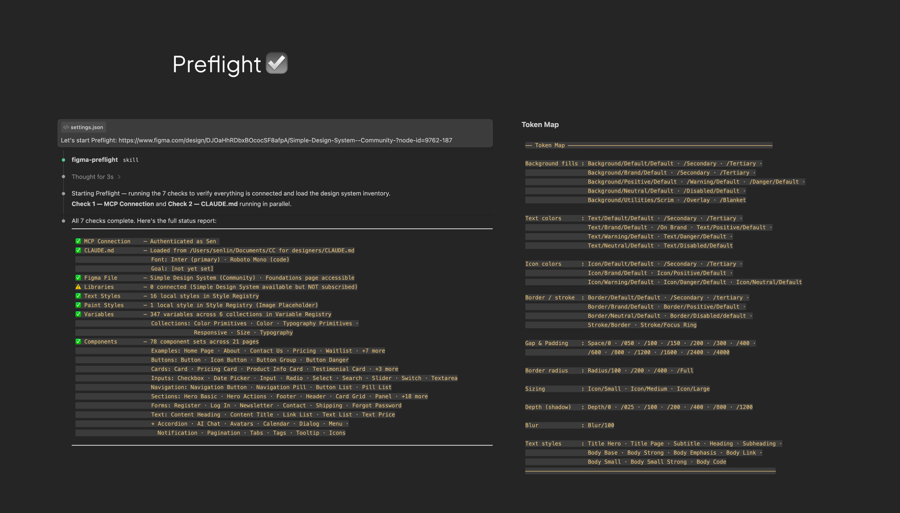

# Claude Code to Figma

[](https://docs.anthropic.com/en/docs/claude-code)
[](https://www.npmjs.com/package/@anthropic-ai/figma-mcp)
[](LICENSE)

Design System compliance for AI-generated Figma designs. 5 skills, 7 preflight checks, zero raw values.

> **Quick start:** Clone, copy skills to `.claude/skills/`, paste your Figma URL into `CLAUDE.md`, say "let's start". [Full install guide below.](#installation)

[Chinese / 中文版](README.zh-CN.md)

---

## Why?

AI can write to Figma now. But without guidance, it builds everything from scratch — hardcoded hex colors, arbitrary font sizes, raw spacing values. The result looks right but is completely disconnected from your Design System. Every color is a magic number. Every component is a one-off. Your design tokens might as well not exist.

cc2figma fixes this with 5 Claude Code Skills that enforce Design System compliance at every step:

- Components are Instances of your Master Components, not rebuilt from scratch
- Colors, fonts, spacing, and radii bind to Variables and Styles, not raw values
- Every write to Figma is automatically verified for token compliance

---

## Before & After

### Without Skills

<!-- Replace with actual screenshot -->


> Hardcoded colors, arbitrary spacing, components built from scratch. Looks right, but zero Design System connection.

### With Skills

<!-- Replace with actual screenshot -->


> Master Component Instances. All visual values bound to Design System Variables and Styles.

---

## Preflight System

Before every design session, 7 automated checks ensure everything is connected:

<!-- Replace with actual screenshot -->


MCP connection, file access, connected libraries, local styles, variables, and components — all verified before a single node is created.

---

## Usage Examples

Say "let's start" to run preflight, then describe what you want:

    You: Build a login page with email and password fields
    Claude: [searches DS for Form, Input, Button components]
            [creates Instances, binds all tokens]
            [takes screenshot for verification]

    You: Add a registration form next to it with a confirm password field
    Claude: [reuses same DS components, adds new section]
            [QA verifies all bindings automatically]

    You: Here's a screenshot of the dashboard we need
    Claude: [analyzes reference, outputs structured Design Brief]
            [builds section by section, verifying after each step]

Every interaction follows the same loop: **search DS** → **create Instances** → **bind tokens** → **verify**.

---

## What's Included

### 5 Skills

| Skill | Trigger | What it does |
| ----- | ------- | ------------ |
| `figma-preflight` | "let's start", first Figma URL | 7 checks + loads Token Map + Component Registry |
| `component-rules` | Any UI construction task | Library-first lookup, Auto Layout, semantic naming |
| `figma-style-binding` | Any color, font, or spacing operation | Enforce Variable / Style binding on all visual values |
| `figma-qa-verifier` | Auto-triggers after every Figma write | Check all nodes for raw values, report violations |
| `reference-interpreter` | Share screenshot, URL, or description | Output structured Design Brief before building |

### How They Work Together

```
"let's start"
    |
    v
 preflight ── verify connection, load tokens + components
    |
    v
 component-rules ──> figma-style-binding
 find & instantiate     bind every visual
 DS components          value to a token
    |                       |
    v                       v
         figma-qa-verifier
         verify all bindings,
         flag any raw values
```

---

## Good For / Not For

| Good For | Not For |
| -------- | ------- |
| Building pages from an existing Design System | Creating a Design System from scratch |
| Describing UI in natural language, Claude builds it in Figma | Pixel-perfect illustration or icon drawing |
| Working in a DS file or a file with a linked DS library | Free-form design without a Design System |
| Ensuring 100% token compliance in design output | FigJam / whiteboard workflows |

---

## Installation

### Prerequisites

- [Claude Code](https://docs.anthropic.com/en/docs/claude-code) (CLI / Desktop / VS Code)
- [Figma MCP Server](https://www.npmjs.com/package/@anthropic-ai/figma-mcp) installed and authenticated
- A Figma file with a Design System (locally defined or linked via Library)

### Install

```bash
# 1. Clone the repo
git clone https://github.com/senlindesign/cc2figma.git

# 2. Copy skills to your project
cp -r cc2figma/.claude/skills/* your-project/.claude/skills/

# 3. Copy config
cp cc2figma/.claude/settings.json your-project/.claude/settings.json

# 4. Copy CLAUDE.md template
cp cc2figma/CLAUDE.md.template your-project/CLAUDE.md
```

### Configure CLAUDE.md

Open `CLAUDE.md` and paste your Figma file URL:

```markdown
# Figma Design Project

- **Figma file:** <https://www.figma.com/design/YOUR_FILE_KEY/...>
- **Fonts:** [leave blank — Preflight auto-detects from your DS]
- **Session goal:** [what are we designing today?]

## Rules

1. Every visual value must bind to a Style or Variable.
2. Always search connected libraries before building any component from scratch.
3. Never start designing before the Design Brief is confirmed.
```

Then say "let's start" in Claude Code. Preflight handles the rest.

---

## Supported Scenarios

| Scenario | How It Works |
| -------- | ------------ |
| **Working in a DS file directly** | Preflight reads all local Styles, Variables, and Components. Full token binding. |
| **New file with a linked DS library** | Component Instances inherit all token bindings from masters automatically. Library variables can be imported for new frames. |

---

## Directory Structure

```
your-project/
├── CLAUDE.md                          # Project config (Figma URL, fonts, rules)
└── .claude/
    ├── settings.json                  # Permissions + QA Hook
    └── skills/
        ├── figma-preflight/           # 7 checks + Token Map + Component Registry
        ├── component-rules/           # Library-first, Auto Layout, naming
        ├── figma-style-binding/       # Color / Text / Spacing binding
        ├── figma-qa-verifier/         # Post-write verification
        └── reference-interpreter/     # Reference → Design Brief
```

---

## Known Limitations

| Limitation | Workaround |
| ---------- | ---------- |
| Doubly-nested Instances can't be directly modified | `detachInstance()` on the outer instance first |
| `getLocalVariablesAsync()` can't see library variables | Instances inherit tokens automatically; use `importVariableByKeyAsync` for new frames |
| Invalid variant values in `setProperties` roll back the entire script | Read `componentPropertyDefinitions` to confirm valid values first |

---

## Contributing

Issues and PRs are welcome. If you have a Figma design workflow that could benefit from a new Skill, describe it in an Issue.

---

MIT © 2025 Sen Lin
