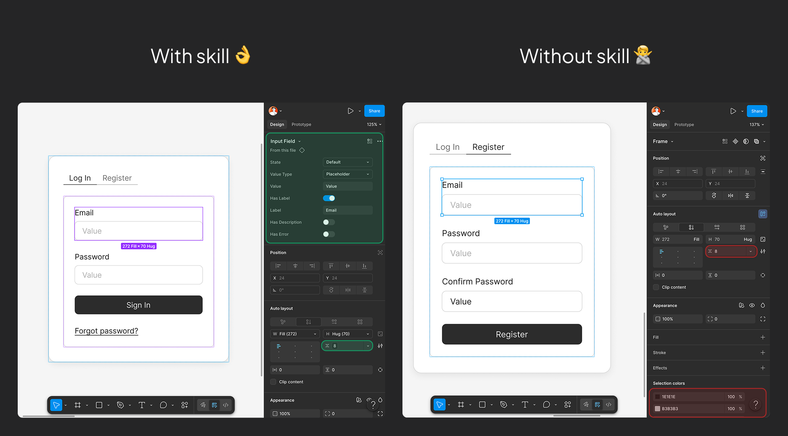

# Claude Code to Figma

[](https://docs.anthropic.com/en/docs/claude-code)
[](https://www.npmjs.com/package/@anthropic-ai/figma-mcp)
[](LICENSE)

让 AI 生成的 Figma 设计 100% 符合 Design System 规范。5 个 Skills，7 项预检，零裸值。

> **快速开始：** 克隆仓库，将 skills 复制到 `.claude/skills/`，在 `CLAUDE.md` 中填入 Figma URL，说 "let's start"。[完整安装指南见下方。](#安装)

[English Version](README.md)

---

## 为什么需要它？

AI 现在可以直接写入 Figma。但如果没有引导，它会从零构建一切——硬编码的十六进制颜色、随意的字号、裸数值的间距。结果看起来没问题，但和你的 Design System 完全脱节。每个颜色都是一个 magic number，每个组件都是一次性的。你的 Design Token 形同虚设。

cc2figma 用 5 个 Claude Code Skills 在每一步强制 Design System 合规：

- 组件是 Master Component 的 Instance，不是从零搭建
- 颜色、字体、间距、圆角全部绑定 Variable 和 Style，不允许裸值
- 每次写入 Figma 后自动验证 Token 绑定状态

---

## 效果对比



> **With Skills：** Master Component 的 Instance，所有视觉值绑定 Design System 的 Variable 和 Style。
> **Without Skills：** 硬编码颜色、随意间距、从零构建的组件——看起来对，但与 Design System 零关联。

---

## Preflight 预检系统

每次设计会话开始前，自动执行 7 项检查，确保一切连接就绪：


MCP 连接、文件权限、已链接 Library、本地 Style、Variable、Component——全部在创建第一个节点之前验证完毕。

---

## 使用示例

说 "let's start" 运行预检，然后描述你想要的设计：

    你：做一个登录页，包含邮箱和密码输入框
    Claude：[查找 DS 中的 Form、Input、Button 组件]
            [创建 Instance，绑定所有 Token]
            [截图验证]

    你：旁边加一个注册表单，多一个确认密码字段
    Claude：[复用相同 DS 组件，新增 section]
            [QA 自动验证所有绑定]

    你：这是我们需要做的 Dashboard 截图
    Claude：[分析参考图，输出结构化 Design Brief]
            [逐个 section 构建，每步验证]

每次交互都遵循相同循环：**查找 DS** → **创建 Instance** → **绑定 Token** → **验证**。

---

## 包含内容

### 5 个 Skills

| Skill | 触发条件 | 职责 |
| ----- | -------- | ---- |
| `figma-preflight` | "let's start"、首次分享 Figma URL | 7 项预检 + 加载 Token Map + Component Registry |
| `component-rules` | 任何 UI 构建任务 | 组件库优先查找、Auto Layout、语义化命名 |
| `figma-style-binding` | 设置颜色、字体、间距 | 强制所有视觉值绑定 Variable / Style |
| `figma-qa-verifier` | 每次写入 Figma 后自动触发 | 检查所有节点的裸值，报告违规 |
| `reference-interpreter` | 分享截图 / URL / 设计描述 | 构建前输出结构化 Design Brief |

### 它们如何协作

```
"let's start"
    |
    v
 preflight ── 验证连接，加载 Token + 组件清单
    |
    v
 component-rules ──> figma-style-binding
 查找并实例化          将每个视觉值
 DS 组件               绑定到 Token
    |                       |
    v                       v
         figma-qa-verifier
         验证所有绑定，
         标记裸值
```

---

## 适合 / 不适合

| 适合 | 不适合 |
| ---- | ------ |
| 基于现有 Design System 搭建页面 | 从零创建 Design System |
| 用自然语言描述 UI，Claude 在 Figma 里构建 | 精细的像素级插画 / 图标绘制 |
| 在 DS 文件或链接了 DS 的新文件中工作 | 没有 Design System 的自由设计 |
| 确保设计产出 100% 遵守 Token 规范 | FigJam / 白板类工作 |

---

## 安装

### 前置条件

- [Claude Code](https://docs.anthropic.com/en/docs/claude-code) (CLI / Desktop / VS Code)
- [Figma MCP Server](https://www.npmjs.com/package/@anthropic-ai/figma-mcp) 已安装并认证
- 一个包含 Design System 的 Figma 文件（本地定义或通过 Library 链接）

### 安装步骤

```bash
# 1. 克隆仓库
git clone https://github.com/senlindesign/cc2figma.git

# 2. 将 skills 复制到你的项目
cp -r cc2figma/.claude/skills/* your-project/.claude/skills/

# 3. 复制配置文件
cp cc2figma/.claude/settings.json your-project/.claude/settings.json

# 4. 复制 CLAUDE.md 模板到项目根目录
cp cc2figma/CLAUDE.md.template your-project/CLAUDE.md
```

### 配置 CLAUDE.md

打开 `CLAUDE.md`，粘贴你的 Figma 文件 URL：

```markdown
# Figma Design Project

- **Figma file:** <https://www.figma.com/design/YOUR_FILE_KEY/...>
- **Fonts:** [留空——Preflight 会自动从 DS 中检测]
- **Session goal:** [今天要设计什么？]

## Rules

1. Every visual value must bind to a Style or Variable.
2. Always search connected libraries before building any component from scratch.
3. Never start designing before the Design Brief is confirmed.
```

然后在 Claude Code 中说 "let's start"。Preflight 会处理剩下的一切。

---

## 适用场景

| 场景 | 工作原理 |
| ---- | -------- |
| **直接在 DS 文件中工作** | Preflight 读取所有本地 Styles、Variables 和 Components，完整 Token 绑定。 |
| **新文件链接了 DS Library** | 组件 Instance 自动继承 Master Component 的所有 Token 绑定。新建 frame 可导入 Library 变量。 |

---

## 目录结构

```
your-project/
├── CLAUDE.md                          # 项目配置（Figma URL、字体、规则）
└── .claude/
    ├── settings.json                  # 权限 + QA Hook
    └── skills/
        ├── figma-preflight/           # 7 项预检 + Token Map + Component Registry
        ├── component-rules/           # 组件库优先、Auto Layout、命名
        ├── figma-style-binding/       # 颜色 / 字体 / 间距绑定
        ├── figma-qa-verifier/         # 写入后验证
        └── reference-interpreter/     # 参考解读 → Design Brief
```

---

## 已知限制

| 限制 | 应对 |
| ---- | ---- |
| 双重嵌套 Instance 无法直接修改内部属性 | 先 `detachInstance()` 外层 |
| `getLocalVariablesAsync()` 看不到 Library 变量 | Instance 自动继承 Token；新建 frame 用 `importVariableByKeyAsync` |
| `setProperties` 传入无效 Variant 值会回滚整个脚本 | 先读 `componentPropertyDefinitions` 确认有效值 |

---

## 贡献

欢迎提交 Issue 和 PR。如果你有新的 Figma 设计场景需要 Skill 支持，请在 Issue 中描述你的工作流程。

---

MIT © 2025 Sen Lin
